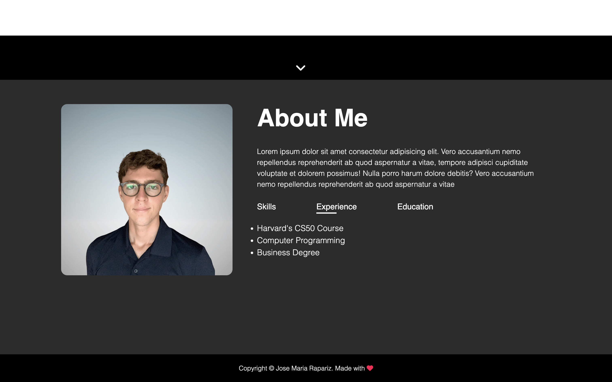
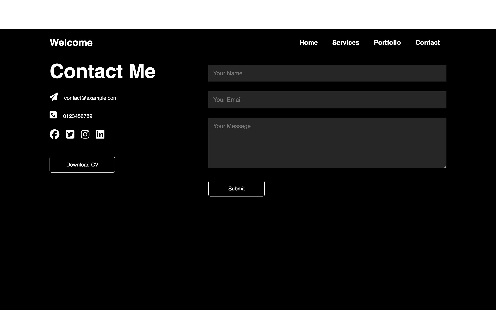

# Portfolio Website

A simple portfolio website with a minimalist design showcasing my skills, experience, and projects. This site was created as part of a CS50 problem set and features a user-friendly layout with interactive elements.


## Overview
1. The home page of the website


2. About me section with a hover effect applied on "Skills", "Experience" and "Education"


3. Offered services page with three images and description text that appears when hovering over them


4. Portfolio section showcasing a different article depending on which entry is the user resting the cursor


5. Contact section containing a form, social media links with hover effects and a "Download CV" button that triggers the download of the file. Moreover, the contact form is linked to a google sheet.


## Technologies Used
This website was exclusively built using HTML, CSS and JavaScript. 

## Features
- **Responsive Design**: Fully responsive across various devices for an optimal user experience.
- **Interactive Elements**: Hover effects and transitions enhance user engagement.
- **Google Sheets Integration**: Contact form submissions are saved directly to a Google Sheet for easy tracking.
- **Downloadable Resume**: One-click resume download for potential employers.

## Installation
To view the website locally:
1. Clone this repository:
   ```bash
   git clone https://github.com/ChemaRapariz/CS50-homepage.git

2. Open index.html in your browser.